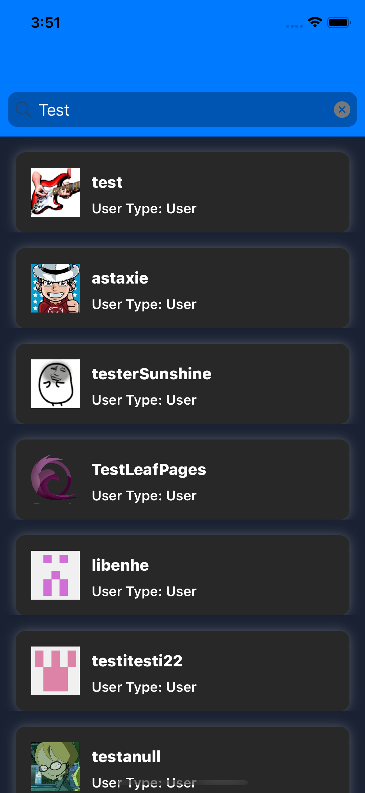

# iOS Test Scalio
This app search the list of users on github by typing the search query in the search bar.

## Getting Started

These instructions will get you a copy of the project up and running on your local machine for development and debugging purposes.

### Prerequisites

Application is using Siwft-Package manager so just open the application and build the code. Wait for Package manager to load all the dependencies. Once all dependencies load, you will be able to run the code.

## Features
- Single page application having a Search control and a list.
- App will support only Potrait mode.

## User Guidelines
- Upon launching, User will have a option to type anything in the search control and search.
- If the search is valid then result will be shown in the list having 9 items.
- If there is any error in the search then Alert message will show.
- Scrolling to bottom causes app to fetch next page and new list of user appended in the list automatically.
- List will display the user Avatar, Name and User type(Individual or Company).

## Technical Notes

### Architecture
- For Architecture purpose MVVM is used along with Builder and Router.
- Builder surves the modules construction prupose.
- Router is used for navigation.
- Moya is used for network calls along with Manager.
- RxSwift are used for binding mechanism.
- Create interfaces to communicate between view-viewmodel-router
- Also include Unit-test to test the VM.

### Third Party
- Kingfisher (For downloading and caching images)
- Moya (For Network calls)
- RxSwift (For reactive programming)

## Sample Screens

## Authors

* **Sharjeel Ali**

